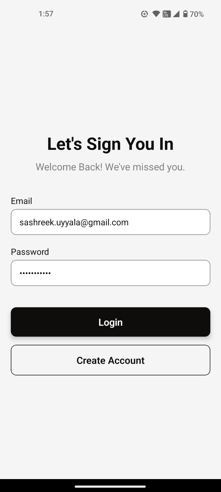
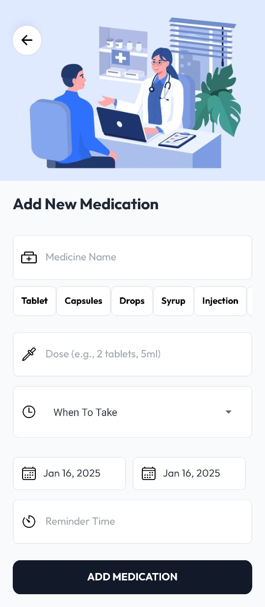
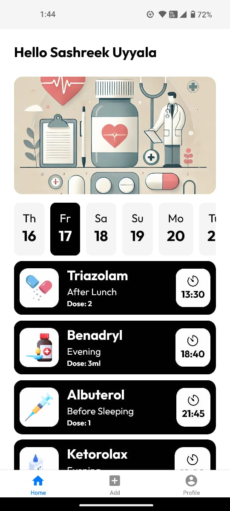
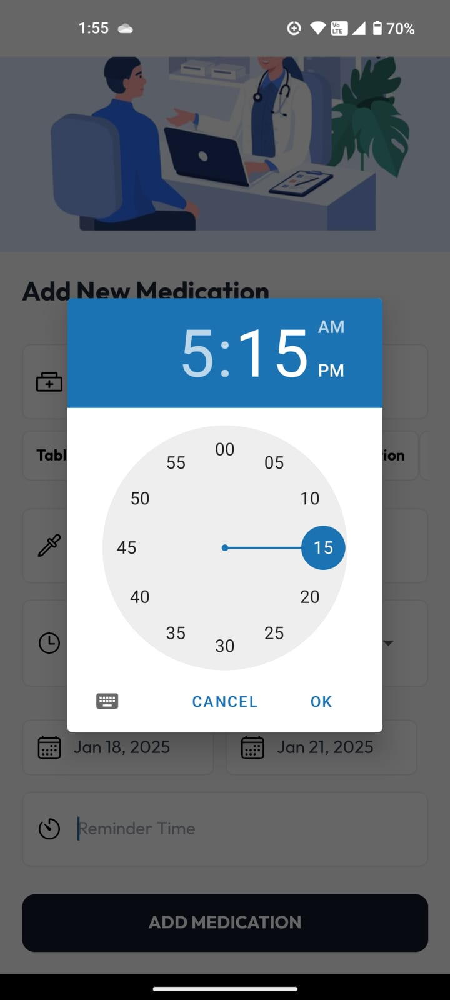
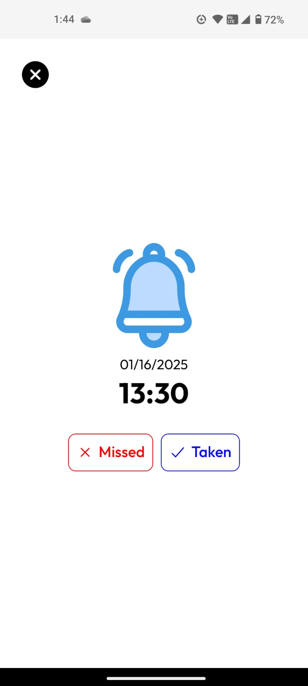
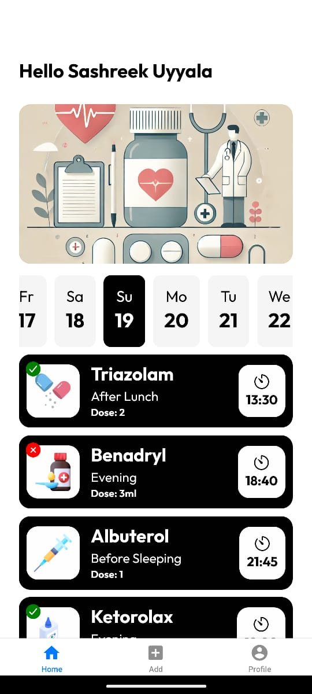

<h1 align="center">Syncure</h1>

  

## Introduction

Syncure - Your Trusted Health Companion

Syncure is a dedicated platform to manage your medication schedule effortlessly. Add medicines, set detailed schedules, and keep track of your doses all in one place. Stay organized and take control of your health with Syncure.

## Requirements

- NPM (Node Package Manager)
- React-Native
- Expo

## Features

- Add medicines with detailed information, including name, dosage, and timing
- Set reminders for each medicine to help you stay on schedule
- Track and manage your daily, weekly, or monthly medication routine
- Edit or update medicine details effortlessly
- View all your scheduled medicines in a clean and organized home screen
- Simple and professional UI for smooth navigation

## Setup

Install all packages

> npm install

## Screenshots

  
    
    &nbsp;&nbsp;&nbsp;&nbsp;
    
  

  
     &nbsp;&nbsp;&nbsp;&nbsp;
     &nbsp;&nbsp;&nbsp;&nbsp;
  

  
     &nbsp;&nbsp;&nbsp;&nbsp;
    
  

  
     &nbsp;&nbsp;&nbsp;&nbsp;
    
    &nbsp;&nbsp;&nbsp;&nbsp;
    
    &nbsp;&nbsp;&nbsp;&nbsp;
    
  
  

  
     &nbsp;&nbsp;&nbsp;&nbsp;
    
  

